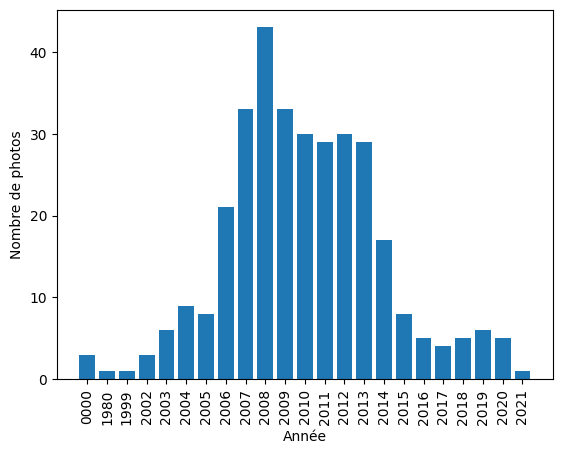
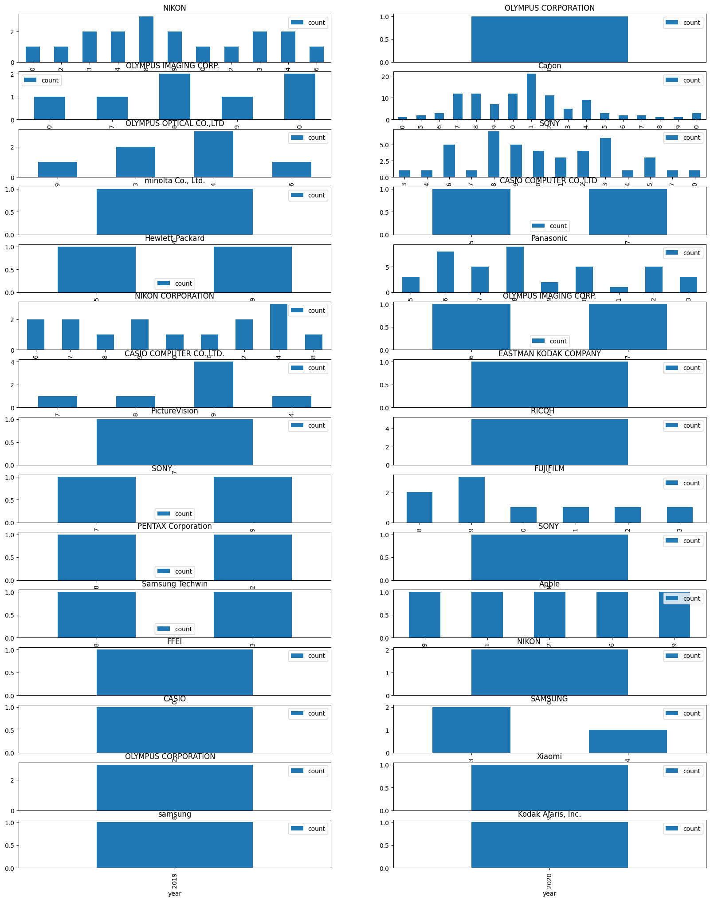
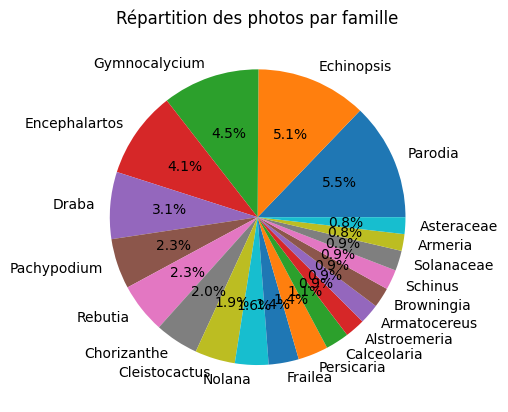
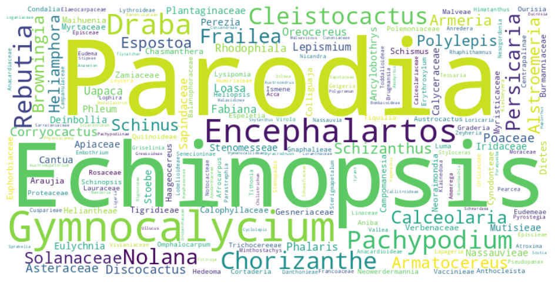
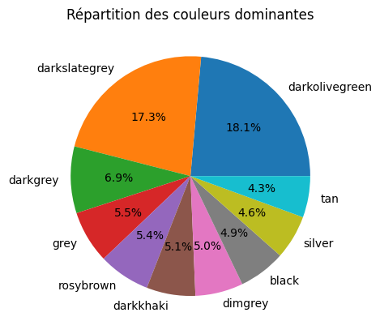
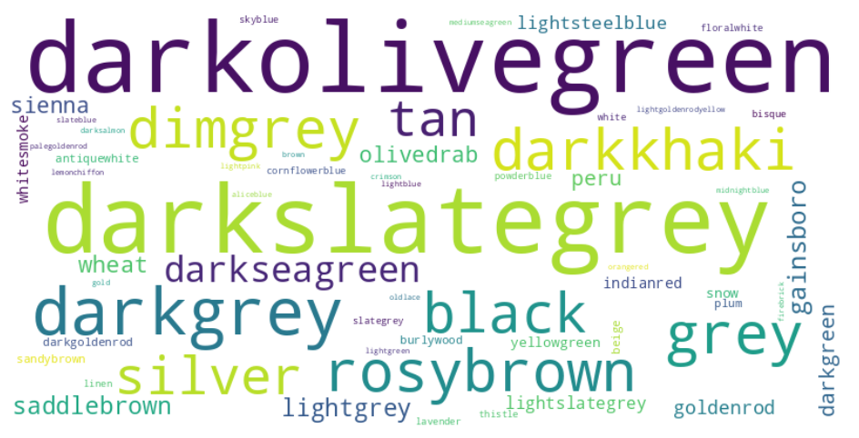
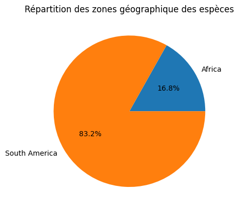

# Rapport Big Data 

### Projet partie 1

### 1. Le but de votre projet 

Le but de ce projet est de développer un système de recommandation d'images basé sur les préférences de l'utilisateur en utilisant Python. Le projet est divisé en plusieurs tâches, qui incluent la collecte, l'annotation, l'analyse et la visualisation des données, ainsi que la création du système de recommandation et des tests. 

La collecte de données implique le téléchargement d'un ensemble d'images et la récupération de métadonnées, à l'aide de fichiers JSON. La tâche d'étiquetage et d'annotation consiste à rechercher des sources pour des informations supplémentaires telles que des balises et des catégories, et à obtenir des informations sur les couleurs prédominantes et les tags. L'analyse de données implique la création d'un profil de préférences utilisateur en utilisant les images sélectionnées, ainsi que l'utilisation de différents types de classificateurs et d'algorithmes de regroupement pour ajouter des informations supplémentaires pour chaque image. 

La visualisation des données implique la création de graphiques et de tableaux pour afficher les caractéristiques des images téléchargées, telles que le nombre d'images disponibles pour chaque année et les différents types d'images. La tâche du système de recommandation consiste à construire un système de recommandation en utilisant des approches telles que le filtrage collaboratif, le filtrage basé sur le contenu ou une approche hybride. Les tests consistent à vérifier si les différentes fonctions du projet fonctionnent correctement. 

Le rapport final du projet doit être un document de 5 pages présentant les différentes étapes du projet, les résultats obtenus et les limites de l'approche choisie. En résumé, le but de ce projet est de créer un système de recommandation d'images personnalisé en utilisant Python en automatisant toutes les tâches liées à l'acquisition, l'annotation, l'analyse et la visualisation des données. 

 

### 2. Collecte de données

Nous avons collecté nos données depuis Wikidata. Ces données sont sous licence CC0 1.0 Universal (CC0 1.0) cela signifie que le créateur d'une œuvre, telle qu'une photographie ou une pièce de musique, peut renoncer à tous les droits d'auteur et droits connexes sur l'œuvre afin de permettre à quiconque de l'utiliser, de la modifier ou de la distribuer librement, sans avoir à demander la permission ou à fournir une attribution (source https://joinup.ec.europa.eu/licence/cc0-10-universal-cc0-10-public-domain-dedication). 

Les données collectées lors de ce projet l'ont été grâce à l'API de Wikidata. Cette API nous a permis d'extraire, de manière automatique grâce au SPARQL, des informations sur des taxons spécifiques à partir de la base de données de Wikidata. Nous avons alors extrait les noms, les images, les noms scientifiques, les familles et les emplacements des taxons de la base de données de Wikidata (en limitant le nombre de données récoltées). Une fois les données extraites les images sont alors téléchargées si elles ne sont pas déjà présentes dans nos données collectées. Le reste des informations des images téléchargées sont stockées dans des fichiers JSON possédant comme nom le nom de l'image. 

Nous avons collecté près de 600 images pour une taille totale de 921Mo. 

### 3. Étiquetage et annotation

Nous avons collecté certaines informations sur chacune des images téléchargées. Les premières informations collectées viennent des requêtes SPARQL faitent lors de leur téléchargement. Ces informations sont : les noms, les images, les noms scientifiques, les familles et les emplacements des taxons. Puis dans un second temps nous avons ajouté des informations provenant de l'image en elle-même comme : sa longueur, sa largeur, son format (le type de fichier), son mode (RGB ou autre). Nous avons aussi récupéré des données EXIF des images afin d'agrandir notre nombre de dimensions étudiées. Depuis les données EXIF nous avons récupéré : date à laquelle l'image a été prise, son copyright, son orientation (paysage / portrait), le modèle et la marque de l'appareil photo. 

De plus nous avons analysé l'image afin d'établir 2 clusters en se basant sur les couleurs de chaque pixel. Cela nous a permis d'établir les 2 couleurs prédominantes de chacune de nos images. Pour cela nous avons utilisé K-Means. Pour faciliter la visualisation nous avons approchés ces "couleurs prédominantes" par les noms de couleurs les plus proches avec WebColors. Ce qui nous permettra de regrouper les couleurs prédominantes trouvées sous des termes compréhensibles et facilement regroupable.

Toutes ces informations sont rajoutées au fichier JSON de chaque image.

### 4. Visualisation des données

Nous avons utilisé différents types de visualisation afin de pouvoir profiter de l'ensemble des dimensions collectées lors des parties *Collecte des données* et *Étiquetage et annotation*.

Pour réaliser cette partie nous avons utilisé matplotlib et wordcloud. 

Voici les visualisations établies à partir de l'ensemble des données collectées :

* Diagramme du nombre de photos par année :

* Diagramme du nombre de photos par année et par marque d'appareil :

* Camembert de la proportion d'images par famille (les 20 plus grandes familles) :

* Nuage de mots de la proportion d'images par famille :

* Camembert de la proportion des couleurs dominantes (les 10 plus nombreuses):

* Nuage de mots de la proportion des couleurs dominantes :

* Répartition des zones géographique des taxons :

Dans cette partie nous avons donc utilisé 3 types de représentation : des camemberts, des histogrammes et des nuages de mots. Les camemberts sont particulièrement utiles pour visualiser les parts relatives d'un ensemble de données. Les proportions de chaque catégorie sont représentées sous forme de segments de cercle, ce qui permet de visualiser rapidement les catégories qui sont les plus importantes et celles qui sont les moins importantes. Tandis que les nuages de mots sont utilisés pour visualiser les fréquences des mots dans un ensemble de données textuelles. Les mots les plus fréquents sont représentés de manière plus grande, ce qui permet de visualiser rapidement les mots les plus importants. Enfin les histogrammes sont utilisés pour visualiser la distribution des données quantitatives. Les données sont regroupées en catégories et représentées sous forme de barres, où la hauteur de chaque barre représente la fréquence de la catégorie. Les histogrammes permettent de visualiser rapidement la forme de la distribution des données, par exemple si elles suivent une distribution normale ou non.

### 5. Informations concernant les préférences de l'utilisateur 

Pour les préférences de l'utilisateur, on a décidé de stocker les informations suivantes :
- Les couleurs prédominantes de l'image
- La famille
- La localisation
 
Dans cette partie, 10 images sont choisies au hasard et viendront créer les préférences qu'aime l'utilisateur. Et 10 autres images seront choisis aléatoirement qui viendront créer les préférences que n'aime pas l'utilisateur. Les métadonnées de chaque image utilisées sont stockées dans un fichier Json nommé "user_data.json" qui nous donnera donc les préférences pour un utilisateur. 
L'utilisateur est simulé au lancement du script. Nous le lançons 10 fois pour avoir un échantillon sur 10 utilisateurs.

Dans le futur on pourrais ajoutez des informations supplémentaires des métadonnées telles que la date de création, la résolution, la taille, le type de fichier, l'emplacement géographique, etc. En outre, des informations sur le contexte de l'image peuvent être utiles, telles que l'objet, la scène ou encore l'événement représenté s'il y'en a un. Ces informations peuvent être utilisées pour aider à la classification et au regroupement des images en fonction de leurs caractéristiques communes.

### 6. Les modèles d'exploration de données et/ou d'apprentissage machine que vous avez utilisés avec les métriques obtenues. 

Afin de réaliser le système de recommandation, nous avions besoin des préférences de l'utilisateur stockées dans un fichier JSON. Les données sont donc extraites de ce fichier puis regroupées dans des tableaux correspondants à chaque image.
Par la suite un tableau contenant les résultats des préférences est également créés, il peut contenir la valeur 'favorite' si l'utilisateur a aimé la photo ou 'not_favorite' dans le cas contraire. Ces tableaux sont par la suite chargés dans des dataset pandas. 

Une fois les données d'entrée correctement préparées et formatées, nous avons pu par la suite mettre en place le système de recommandation.  

Nous avons choisi pour cela d'utiliser un classificateur forestier aléatoire qui est une méthode de classification en apprentissage automatique qui combine plusieurs arbres de décision pour produire un modèle de prédiction. Ce dernier a été choisi pour plusieurs raisons:
- il est capable de produire des modèles de prédiction très précis, ce qui est très utile pour les tâches de classification où la précision est primordiale
- il est très simple à utiliser de ne nécessite pas beaucoup de paramètres à régler
- il fourni également des information sur l'importance de chaque variable dans la décision, cela permet de comprendre les relations entre les données d'entrées et le résultat obtenu
Ses avantages en comparaison aux classificateurs utilisant des machines à vecteurs de support (comme svc) est qu'il est possible de contrer le problème de sur-ajustement en changeant la taille de l'arbre.
Pour ces raisons, le classificateur Random Forest nous a paru être un choix pertinent.

Une fois le système de recommandation mis en place, nous nous sommes heurté à un problème lors de nos tests. Lorsqu'un utilisateur souhaite obtenir une recommandation et fourni des données qui n'ont pas encore connu en tant que label dans notre arbre décision, cela provoque une erreur, il a donc été décidé de mettre en place de système de substitution aléatoire pour gérer ce problème. Lorsque les utilisateurs utilisent la fonction de recommandation, nous vérifions si les valeurs fournies existent déjà dans notre arbre, si ce n'est pas le cas alors elles sont remplacées aléatoirement pas des valeurs existantes.

Nous avons par la suite poursuivi nos tests afin de d'évaluer la précision et la pertinence du système de recommandation. Pour cela, plusieurs profondeurs d'arbres ont été testées, entre 2 et 5. La profondeur d'arbre est le principal élément permettant d'ajuster la précision de la recommandation, cependant une profondeur trop grande est plus susceptible de sur-ajuster les données d'entraînement, ce qui signifie qu'il sera très précis sur les données d'entraînement mais moins précis sur les nouvelles données. Dans notre cas, les données étant simple, elles ne nécessitent pas des arbres avec une grande profondeur.

Après avoir pu régler ces problèmes nous avons pu conclure nos tests du système de recommandation en utilisant des préférences fixes et non plus aléatoires et tester les prédictions pour des données présentes dans ces préférences.
Ces derniers tests nous ont permis de constater le bon fonctionnement de la fonctionnalité de recommandation et de confirmer le choix du Random Forest.

### 7. L'auto-évaluation de votre travail. 

Dans ce projet, on a mis en place un système de recommandation d'images en Python. On a réussi à collecter plus de 100 images en utilisant des données en libre accès, enregistrant toutes les métadonnées pertinentes dans des fichiers JSON. On a également annoté les images en utilisant des algorithmes de regroupement pour trouver les couleurs prédominantes et en ajoutant des tags, qui ont été saisis manuellement ou collectés auprès des utilisateurs. On a construit des profils d'utilisateurs à partir des informations recueillies en utilisant les images sélectionnées, et on a utilisé ces profils pour recommander des images pertinentes. 

On a réussi à automatiser la plupart des tâches liées à l'acquisition, l'annotation, l'analyse et la visualisation des données, ce qui a permis de gagner beaucoup de temps. Cependant, on a rencontré quelques difficultés dans la collecte des données et l'annotation des images, en particulier pour trouver des informations supplémentaires telles que les tags. 

La visualisation des données était une tâche intéressante et on a réussi à créer des graphiques pour montrer les différentes caractéristiques des images téléchargées, ainsi que les informations liées à chaque profil d'utilisateur. Enfin, on a testé le système de recommandation et a trouvé que les recommandations étaient pertinentes pour la plupart des utilisateurs. 

En conclusion, on est satisfait de notre travail et on a réussi à atteindre nos objectifs. Cependant, on pense qu'on aurait pu mieux planifier certaines tâches et trouver plus d'informations supplémentaires pour l'annotation des images. Dans l'ensemble, c'était un projet stimulant et on a appris beaucoup de choses intéressantes sur la collecte, l'annotation et la recommandation d'images. 

 

### 8. Remarques concernant les séances pratiques, les exercices et les possibilités d'amélioration. 

Concernant les exercices, nous avons remarqué qu'ils sont souvent bien conçus et pertinents pour le sujet étudié. Les séances pratiques sont très utiles pour mettre en pratique les concepts théoriques, mais il serait bénéfique d'avoir plus de temps pour travailler sur les exercices.

### 9. Conclusion 

Le projet de création d'un système de recommandation d'images personnalisé en utilisant Python a été mené à bien. Nous avons utilisé l'API de Wikidata pour collecter près de 600 images pour une taille totale de 921Mo. Nous avons ensuite collecté des informations sur chacune des images en utilisant les requêtes SPARQL pour extraire des informations de base, puis en analysant les images pour récupérer des informations supplémentaires telles que les données EXIF, les dimensions de l'image, les couleurs prédominantes, etc.

Nous avons créé des graphiques et des tableaux pour visualiser les caractéristiques des images téléchargées et avons utilisé des approches telles que le filtrage collaboratif, le filtrage basé sur le contenu et une approche hybride pour construire notre système de recommandation. Nous avons également effectué des tests pour vérifier si les différentes fonctions du projet fonctionnent correctement.

En conclusion, ce projet nous a permis de créer un système de recommandation d'images personnalisé en utilisant Python en automatisant toutes les tâches liées à l'acquisition, l'annotation, l'analyse et la visualisation des données. Cela a été réalisé en utilisant une variété d'approches telles que le traitement du langage naturel, le traitement d'images et l'apprentissage automatique. Bien que ce projet ait atteint ses objectifs, il y a encore des améliorations possibles dans l'avenir, comme la collecte de données supplémentaires et l'utilisation de techniques plus avancées pour améliorer la qualité des recommandations.
 
