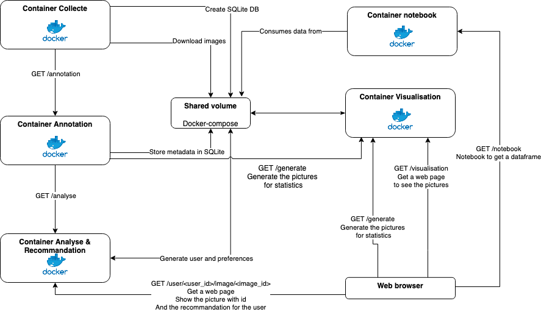

# Projet TDM

## Schéma de fonctionnement 



Nous avons cinq conteneurs qui composent notre application :

- **collecte**: ce conteneur est chargé de récupérer des données depuis le site de Wikidata et les stocker dans la base de données SQLite et télécharger les images dans le volume partagé. Une fois le téléchargement terminé, il signale à l'annotation de lancer son processus sur les nouvelles données. 
- **annotation**: ce conteneur est chargé de lancer le processus d'annotation sur les données récupérées par le conteneur de collecte. Comme expliqué dans le rapport de projet, nous effectuons différentes analyse sur les images et leur metadonnées. Cela inclut des techniques de clustering et de classification. Une fois le processus terminé, il stocke ces informations dans la base de données SQLite et il signale au conteneur de visualisation de lancer son processus sur les nouvelles données. Il signale également au conteneur d'analyse et de recommandation de lancer son processus en incluant les nouvelles données.
- **analyse**: ce conteneur est chargé de lancer le processus d'analyse sur les données récupérées par le conteneur d'annotation. Ce conteneur permet de générer des préférences sur les différents utilisateur de l'application. C'est préférence sont stockées dans la base de données SQLite dans les tables *liked* et *disliked*. Ces tables font le lien entre les images aimées ou par les utilisateurs.  Ce conteneur permet aussi de prédire si une image sera aimée ou non par un utilisateur. Nous pouvons aussi rajouté manuellement des préférences pour un utilisateur en disant si un utilisateur aime ou non une image (/user/<user_id>/image/<image_id>/(liked|disliked)). 
- **visualisation**: ce conteneur est chargé de lancer le processus de visualisation sur les données récupérées par le conteneur d'annotation. Ce conteneur permet de générer des graphiques sur les données récupérées. Ces graphiques sont stockés dans le volume partagé et accèssible avec sur le chemin /visualisation.
- **notebook**: ce conteneur est chargé de lancer un notebook avec les données sur les images récupérées de la base de données chargée dans un dataframe Pandas. Ce conteneur permet à l'utilisateur de faire des analyses sur les données récupérées.

La collecte est un job qui peut être lancé chronologiquement et qui pourra ainsi augmenter la tailles de la base de données. 

## Lancement de l'application

Vous disposé d'un fichier docker-compose.yml qui vous permet de lancer l'application. Pour cela, il vous suffit de lancer la commande suivante :

```bash
docker-compose up
```

Vous pouvez changer le nombre d'images téléchargé par le conteneur de collecte en modifiant la variable *LIMIT* qui est fixé à 10 par défaut dans le fichier collecte/Collecte.py.

Les ports utilisés par les différents conteneurs sur la machine sont les suivants :
-   annotation : 3001
-   analyse/recommandation : 8080
-   visualisation : 3002
-   notebook : 8888

Les apis disposent d'une documentation swagger qui est disponible sur les liens suivants :
-   annotation : 
    - http://localhost:3001/docs
-   analyse/recommandation :
    - http://localhost:8080/swagger-ui
    - http://localhost:8080/swagger
-   visualisation :
    - http://localhost:3002/swagger-ui
    - http://localhost:3002/swagger

